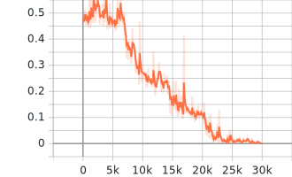
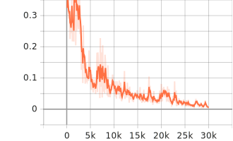
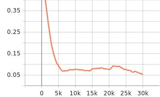
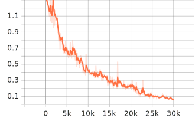

# Experiment 01

- Model: SSD MobileNet v2 320x320
- Configuration:
  - Default parameters
  - No augmentation
  - 30k iterations
- Data:
  - Synthetically generated
  - Only digits
  - Randomly placed in 512x512 canvas, with a ranging font size
  - 800 images
  - Single font (seven segment)

## Results

*Classification loss*

*Localization loss*

*Regularization loss*

*Total loss*

## TODO

- [ ] add confusion matrix & accuracy w/ mAP