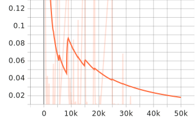
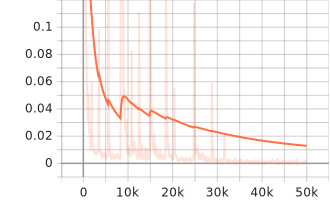
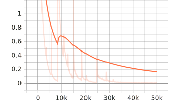
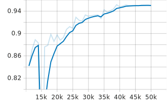
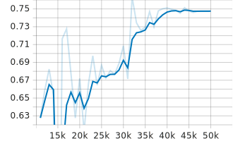

# Experiment 02

- Model: SSD MobileNet v2 320x320
- Configuration:
  - Default parameters
  - No augmentation
  - 50k iterations
- Data:
  - Energy meter datset
  - Only digits
  - 167 images

## Results



*Classification loss*



*Localization loss*



*Total loss*



*Precision mAP@.50IOU*



*Precision mAP@.75IOU*


*Recall AR@100*

## Scores

```
 Average Precision  (AP) @[ IoU=0.50:0.95 | area=   all | maxDets=100 ] = 0.639
 Average Precision  (AP) @[ IoU=0.50      | area=   all | maxDets=100 ] = 0.950
 Average Precision  (AP) @[ IoU=0.75      | area=   all | maxDets=100 ] = 0.748
 Average Precision  (AP) @[ IoU=0.50:0.95 | area= small | maxDets=100 ] = -1.000
 Average Precision  (AP) @[ IoU=0.50:0.95 | area=medium | maxDets=100 ] = 0.000
 Average Precision  (AP) @[ IoU=0.50:0.95 | area= large | maxDets=100 ] = 0.649
 Average Recall     (AR) @[ IoU=0.50:0.95 | area=   all | maxDets=  1 ] = 0.536
 Average Recall     (AR) @[ IoU=0.50:0.95 | area=   all | maxDets= 10 ] = 0.685
 Average Recall     (AR) @[ IoU=0.50:0.95 | area=   all | maxDets=100 ] = 0.685
 Average Recall     (AR) @[ IoU=0.50:0.95 | area= small | maxDets=100 ] = -1.000
 Average Recall     (AR) @[ IoU=0.50:0.95 | area=medium | maxDets=100 ] = 0.000
 Average Recall     (AR) @[ IoU=0.50:0.95 | area= large | maxDets=100 ] = 0.695
INFO:tensorflow:Eval metrics at step 50000
I1205 06:51:38.613644 140665885132672 model_lib_v2.py:1015] Eval metrics at step 50000
INFO:tensorflow:	+ DetectionBoxes_Precision/mAP: 0.639319
I1205 06:51:38.625162 140665885132672 model_lib_v2.py:1018] 	+ DetectionBoxes_Precision/mAP: 0.639319
INFO:tensorflow:	+ DetectionBoxes_Precision/mAP@.50IOU: 0.949898
I1205 06:51:38.626815 140665885132672 model_lib_v2.py:1018] 	+ DetectionBoxes_Precision/mAP@.50IOU: 0.949898
INFO:tensorflow:	+ DetectionBoxes_Precision/mAP@.75IOU: 0.747549
I1205 06:51:38.628303 140665885132672 model_lib_v2.py:1018] 	+ DetectionBoxes_Precision/mAP@.75IOU: 0.747549
INFO:tensorflow:	+ DetectionBoxes_Precision/mAP (small): -1.000000
I1205 06:51:38.629832 140665885132672 model_lib_v2.py:1018] 	+ DetectionBoxes_Precision/mAP (small): -1.000000
INFO:tensorflow:	+ DetectionBoxes_Precision/mAP (medium): 0.000000
I1205 06:51:38.631118 140665885132672 model_lib_v2.py:1018] 	+ DetectionBoxes_Precision/mAP (medium): 0.000000
INFO:tensorflow:	+ DetectionBoxes_Precision/mAP (large): 0.648746
I1205 06:51:38.632639 140665885132672 model_lib_v2.py:1018] 	+ DetectionBoxes_Precision/mAP (large): 0.648746
INFO:tensorflow:	+ DetectionBoxes_Recall/AR@1: 0.536422
I1205 06:51:38.634019 140665885132672 model_lib_v2.py:1018] 	+ DetectionBoxes_Recall/AR@1: 0.536422
INFO:tensorflow:	+ DetectionBoxes_Recall/AR@10: 0.684852
I1205 06:51:38.635367 140665885132672 model_lib_v2.py:1018] 	+ DetectionBoxes_Recall/AR@10: 0.684852
INFO:tensorflow:	+ DetectionBoxes_Recall/AR@100: 0.684852
I1205 06:51:38.636549 140665885132672 model_lib_v2.py:1018] 	+ DetectionBoxes_Recall/AR@100: 0.684852
INFO:tensorflow:	+ DetectionBoxes_Recall/AR@100 (small): -1.000000
I1205 06:51:38.637772 140665885132672 model_lib_v2.py:1018] 	+ DetectionBoxes_Recall/AR@100 (small): -1.000000
INFO:tensorflow:	+ DetectionBoxes_Recall/AR@100 (medium): 0.000000
I1205 06:51:38.639001 140665885132672 model_lib_v2.py:1018] 	+ DetectionBoxes_Recall/AR@100 (medium): 0.000000
INFO:tensorflow:	+ DetectionBoxes_Recall/AR@100 (large): 0.694673
I1205 06:51:38.640712 140665885132672 model_lib_v2.py:1018] 	+ DetectionBoxes_Recall/AR@100 (large): 0.694673
INFO:tensorflow:	+ Loss/localization_loss: 0.095392
I1205 06:51:38.641782 140665885132672 model_lib_v2.py:1018] 	+ Loss/localization_loss: 0.095392
INFO:tensorflow:	+ Loss/classification_loss: 0.624174
I1205 06:51:38.642804 140665885132672 model_lib_v2.py:1018] 	+ Loss/classification_loss: 0.624174
INFO:tensorflow:	+ Loss/regularization_loss: 0.006422
I1205 06:51:38.643857 140665885132672 model_lib_v2.py:1018] 	+ Loss/regularization_loss: 0.006422
INFO:tensorflow:	+ Loss/total_loss: 0.725988
I1205 06:51:38.644900 140665885132672 model_lib_v2.py:1018] 	+ Loss/total_loss: 0.725988
```